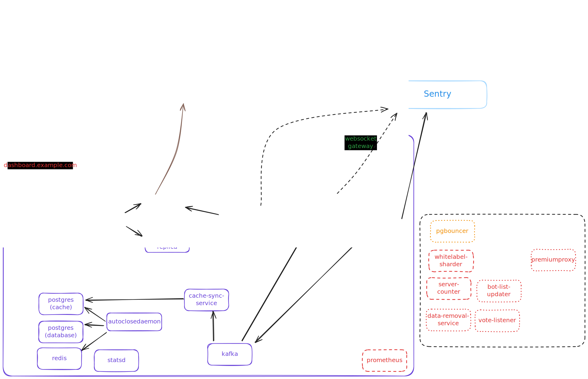

# Self Hosting Tickets Bot

This is a guide to self host the [Tickets bot](https://discord.com/users/508391840525975553). Which was [announced to sunset on the 5th of March 2025](https://discord.com/channels/508392876359680000/508410703439462400/1325516916995129445) in [their support server](https://discord.gg/XX2TxVCq6g). This guide will help you set up the bot on your own machine using Docker. **This is not an official guide and I will not provide support.**

## Pre-requisites

- You must have knowledge of how to use, deploy and run containers (specifically Docker)
- You must have an idea of how to use a terminal
- You should have a basic understanding of GoLang, Rust, and Svelte
- You should have a basic understanding of how to use a database (specifically PostgreSQL)

## How does the bot work?

To be completely honest, I still don't know. The image below is a rough diagram of how I think the bot works after nearly a week of tinkering with the TicketsBot codebase. The dotted boxes are the containers that I did not implement into the `docker-compose.yaml` in this repository.


The image above was made using [Excalidraw](https://excalidraw.com/).

## Setup

1. Open a terminal in the folder you want to install the bot in. (Or create a folder and open a terminal in that folder)
2. Clone this repository into that folder (`git clone https://github.com/DanPlayz0/ticketsbot-self-host-guide.git .`)
   - The `.` at the end is important as it clones the repository into the current folder
3. Create an `.env` file by copying the provided `.env.example` file.

   - `DISCORD_BOT_TOKEN`: your bot token (e.g. `OTAyMzYyNTAxMDg4NDM2MjI0.YXdUkQ.TqZm7gNV2juZHXIvLdSvaAHKQCzLxgu9`)
   - `DISCORD_BOT_CLIENT_ID`: your bot's client ID (e.g. `508391840525975553`)
   - `DISCORD_BOT_OAUTH_SECRET`: your bot's client secret (e.g. `AAlRmln88YpOr8H8j1VvFuidKLJxg9rM`)
   - `DISCORD_BOT_PUBLIC_KEY`: your bot's public key (e.g. `fcd10216ebbc818d7ef1408a5c3c5702225b929b53b0a265b82e82b96a9a8358`)
   - `ADMIN_USER_IDS`: a comma-separated list of user IDs (e.g. `209796601357533184,585576154958921739,user_id,user_id`, a single id would be `209796601357533184`)
   - `DISCORD_SUPPORT_SERVER_INVITE`: the invite link to your support server (e.g. `https://discord.gg/ticketsbot`)
   - `DASHBOARD_URL`: the URL of your dashboard (e.g. `http://localhost:5000`)
   - `LANDING_PAGE_URL`: the URL of your landing page (e.g. `https://ticketsbot.cloud`)
   - `API_URL`: the URL of your API (e.g. `http://localhost:8082`)
   - `DATABASE_HOST`: your PostgreSQL host (e.g. `postgres:5432`)
   - `DATABASE_PASSWORD`: your PostgreSQL password (e.g. `password`)
   - `CACHE_DATABASE_HOST`: your cache database host (e.g. `postgres-cache:5432`)
   - `CACHE_DATABASE_PASSWORD`: your cache database password (e.g. `password`)
   - `S3_ENDPOINT`: the endpoint of your S3 bucket (e.g. `minio:9000`)
   - `S3_ACCESS`: the access key of your S3 bucket (e.g. `AbCdEfFgHiJkLmNoPqRsTuVwXyZ`)
   - `S3_SECRET`: the secret key of your S3 bucket (e.g. `AbCdEfFgHiJkLmNoPqRsTuVwXyZ`)
   - `ARCHIVER_AES_KEY`: your AES-128 key (e.g. `randomstring`)
     - Bash: `openssl rand -hex 16`
     - NodeJS: `node -e "console.log(require('crypto').randomBytes(16).toString('hex'))"`
   - `ARCHIVER_ADMIN_AUTH_TOKEN`: your archiver admin auth token (e.g. `randomstring`)
   - `SENTRY_DSN`: your Sentry DSN (e.g. `https://examplePublicKey@o0.ingest.sentry.io/0`)

4. Replace the placeholders in the following command and paste it at the bottom of `init-archive.sql`. There are 2 placeholders in the command, `${S3_ARCHIVE_BUCKET}` and `${S3_ENDPOINT}`. Replace them with your bucket name and S3 endpoint respectively. You can also just edit the `init-archive.sql` file too, you just have to uncomment it (by removing the `--` at the start of the line) and replace variables there.

   ```sql
   INSERT INTO buckets (id, endpoint_url, name, active) VALUES ('b77cc1a0-91ec-4d64-bb6d-21717737ea3c', 'https://${S3_ENDPOINT}', '${S3_ARCHIVE_BUCKET}', TRUE);
   ```

5. Run `docker compose up -d` to pull the images and start the bot.
6. Configure the Discord bot. ([see below](#discord-bot-configuration))
7. Register the slash commands ([see below](#registering-the-slash-commands-using-docker-recommended))

## Discord Bot Configuration

As this bot is self-hosted, you will need to configure the bot yourself. Here are the steps to configure the bot:

1. Go to the [Discord Developer Portal](https://discord.com/developers/applications)
2. Click on the application you created for the bot
3. Set the `Interactions Endpoint URL` to `${HTTP_GATEWAY}/handle/${DISCORD_BOT_CLIENT_ID}`
   - Replace `${HTTP_GATEWAY}` with the URL of your HTTP Gateway (e.g. `http://localhost:8080`, you must have a [publicly accessible URL](./wiki/faq.md#6-i-want-anyone-to-be-able-to-use-the-dashboard-how-do-i-do-that) not localhost)
   - Replace `${DISCORD_BOT_CLIENT_ID}` with your bot's application/client ID (e.g. `508391840525975553`)
4. Go to the OAuth2 tab
5. Add the redirect URL `${DASHBOARD_URL}/callback` to the OAuth2 redirect URIs
   - Replace `${DASHBOARD_URL}` with the URL of your API (e.g. `http://localhost:8080`, make sure this matches what you set in the [Setup](#setup) section)

## Registering the slash commands using Docker (Recommended)

1. Build the register commands cli utility using `docker build -t ticketsbot/registercommands -f commands.Dockerfile .`
   - Get help by running `docker run --rm ticketsbot/registercommands --help`
2. Register the commands
   - Global commands only: `docker run --rm ticketsbot/registercommands --token=your_bot_token --id=your_client_id`
   - Global & Admin commands by running `docker run --rm ticketsbot/registercommands --token=your_bot_token --id=your_client_id --admin-guild=your_admin_guild_id`

## Frequently Asked Questions

For frequently asked questions, please refer to the [FAQ](./wiki/faq.md) document.

- [What can I host this on?](./wiki/faq.md#1-what-can-i-host-this-on)
- [What are the system requirements?](./wiki/faq.md#2-what-are-the-system-requirements)
- [Can I turn off the logging?](./wiki/faq.md#3-can-i-turn-off-the-logging)
- [How do I update the bot?](./wiki/faq.md#4-how-do-i-update-the-bot)
- [How do I get rid of the `ticketsbot.net` branding?](./wiki/faq.md#5-how-do-i-get-rid-of-the-ticketsbotnet-branding)
- [I want anyone to be able to use the dashboard, how do I do that?](./wiki/faq.md#6-i-want-anyone-to-be-able-to-use-the-dashboard-how-do-i-do-that)
- [This requires S3, can I host this without S3? (NOT recommended)](./wiki/faq.md#7-this-requires-s3-can-i-host-this-without-s3-not-recommended)
- [How do I activate premium features?](./wiki/faq.md#8-how-do-i-activate-premium-features)
- [How do I run the sql commands inside the database containers?](./wiki/faq.md#9-how-do-i-run-the-sql-commands-inside-the-database-containers)
- [How do I import data from ticketsbot.net?](./wiki/faq.md#10-how-do-i-import-data-from-ticketsbotnet)

## Common Issues

For common issues, please refer to the [Common Issues](./wiki/common-issues.md) document.

- [There's an error. (`no active bucket`)](./wiki/common-issues.md#1-theres-an-error-no-active-bucket)
- [I got an error while setting the interactions url. (`The specified interactions endpoint url could not be verified.`)](./wiki/common-issues.md#2-i-got-an-error-while-setting-the-interactions-url-the-specified-interactions-endpoint-url-could-not-be-verified)
- [Invalid OAuth2 redirect_uri](./wiki/common-issues.md#3-invalid-oauth2-redirect_uri)
- [ERROR: column "last_seen" of relation does not exist](./wiki/common-issues.md#4-error-column-last_seen-of-relation-does-not-exist)
- [I can't login to the dashboard. Every time I try to login, it loops/redirects me back to the login page](./wiki/common-issues.md#5-i-cant-login-to-the-dashboard-every-time-i-try-to-login-it-loopsredirects-me-back-to-the-login-page)
- [When I run a command, I get an error](./wiki/common-issues.md#6-when-i-run-a-command-i-get-an-error)
- [ERROR: relation "import_logs" does not exist](./wiki/common-issues.md#7-error-relation-import_logs-does-not-exist)
- [Failed to get import runs: An internal server error occurred](./wiki/common-issues.md#7-error-relation-import_logs-does-not-exist)

## Migrations

If you have previously setup the bot and want to update to the latest version, you will need to run the following based on when you set this up. (Sorted newest first)

- Before [Guide PR#14](https://github.com/DanPlayz0/ticketsbot-self-host-guide/pull/14), use [Common Issue #7](./wiki/common-issues.md#7-error-relation-import_logs-does-not-exist)
- Before [Guide PR#9](https://github.com/DanPlayz0/ticketsbot-self-host-guide/pull/9), use [Common Issue #4](./wiki/common-issues.md#4-error-column-last_seen-of-relation-does-not-exist)